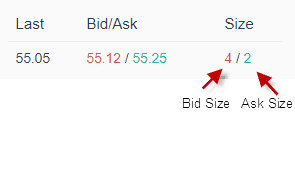
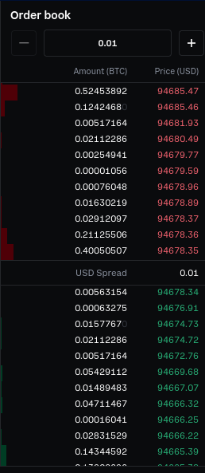
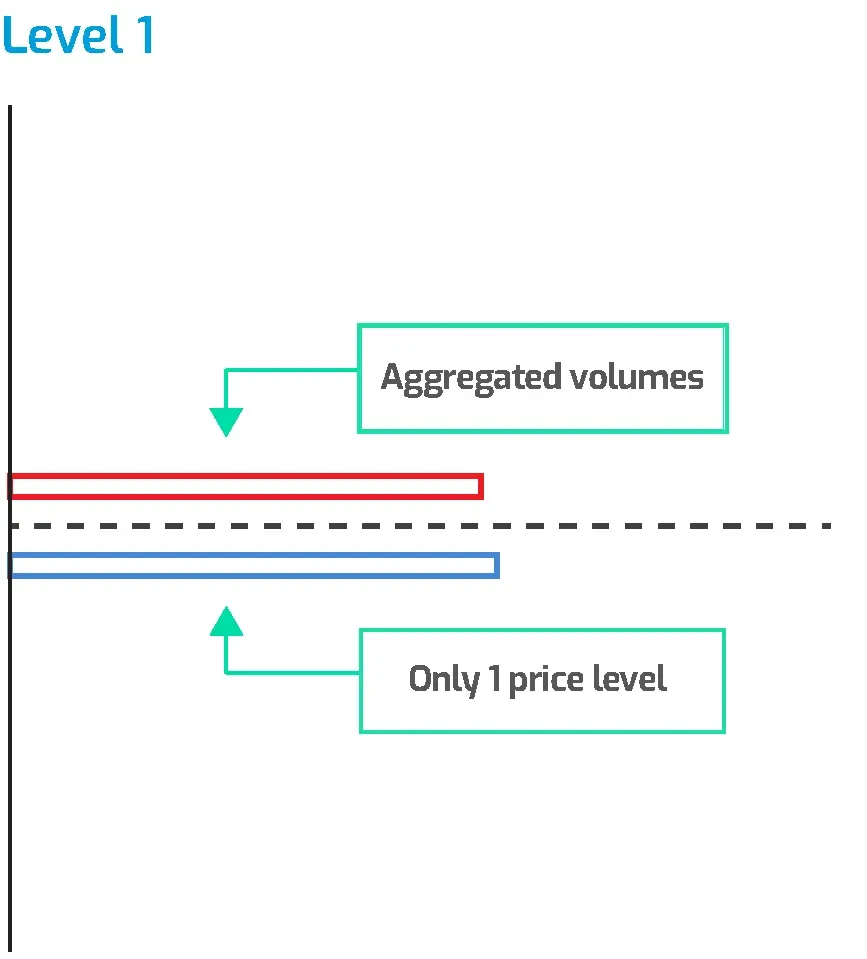
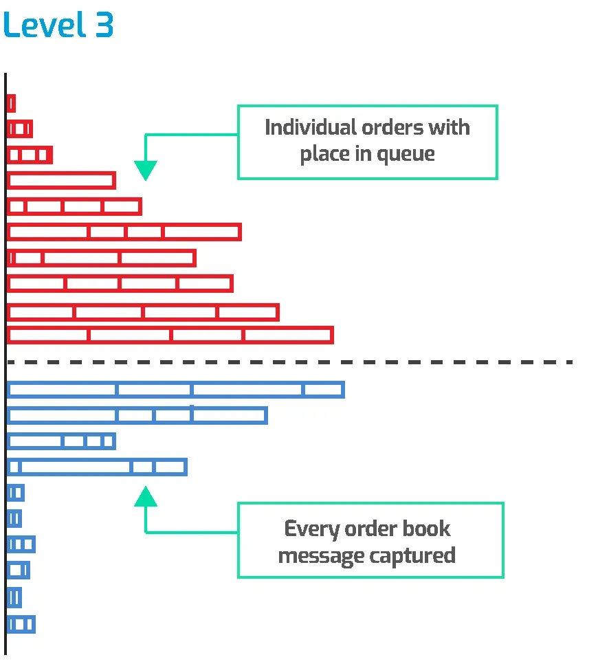
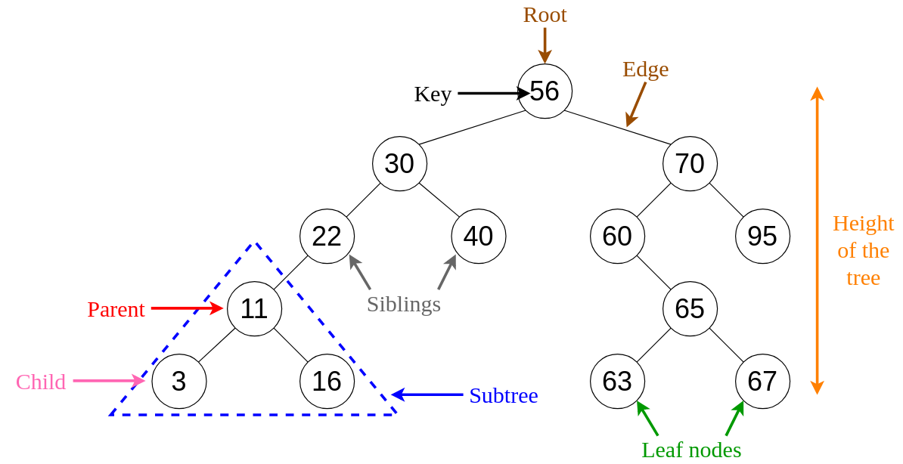
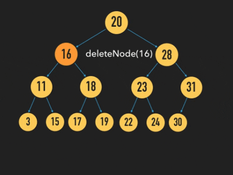

# Limit Order Book

## 1. Introduction

### 1.1 What is a limited order book (LOB)

- A limit order book is a record of outstanding limit orders. A limit order is a
  type of order to buy or sell a security at a specific price or
  better.[[What Is a Limit Order Book?]](https://www.investopedia.com/terms/l/limitorderbook.asp)

### 1.2 L1/L2/L3 market data

- **L1 market data:** Provides more comprehensive by displaying the full depth
  of the order book. This includes multiple bid and ask prices at different
  levels, not just the best available
  prices [[Market Data](https://www.interactivebrokers.com/en/pricing/market-data-pricing.php)]

  

- **L2 market data:** Provides more comprehensive by displaying the full depth
  of the order book. This includes multiple bid and ask prices at different
  levels, not just the best available
  prices. [[Market Data](https://www.interactivebrokers.com/en/pricing/market-data-pricing.php)]
  L2 data is also sometimes referred to as market-by-price (MBP), since
  the updates to book depth are usually keyed by price or price level. It may
  also be called market depth or depth of market (
  DoM). [[L2](https://databento.com/microstructure/level-2-market-data)]

  

- **L3 market data:** Level 3 (L3) refers to market data that provides every
  individual buy and sell order at every price level. This is often also the
  highest granularity of data
  available. L3 data is also called market by order or full order book
  data. [[L3](https://databento.com/microstructure/level-3-market-data)]

    

      
      
      
    

## 2. Factors to consider before implementing an LOB

- To give some idea of the data volumes,
  the [Nasdaq TotalView ITCH](https://data.nasdaq.com/databases/NTV) feed,
  which is every event in every instrument traded on the Nasdaq, can have data
  rates of 20+ gigabytes/day with spikes of 3 megabytes/second or more. The
  individual messages average about 20 bytes each so this means handling
  100,000-200,000 messages per second during high volume
  periods. [[How to Build a Fast Limit Order Book]](https://web.archive.org/web/20110219163448/http://howtohft.wordpress.com/2011/02/15/how-to-build-a-fast-limit-order-book/)

### 2.1 The business use case

- Consider the below factors:
    - What queries need to be optimized for your application?
    - Sparsity of the book.
    - Statistical distribution of book
      events. [[Red Black Trees for Limit Order Book](https://quant.stackexchange.com/a/63161/83130)]

- Markets/products to trade/liquidity impacts engineering decisions:
    - In illiquid options, there may be very few resting orders on the book, so
      it may be cheaper to just store everything in arrays and linearly walk
      through them.
    - In liquid futures, most events only affect a few hundred price levels, and
      price bands might give you a bound on levels that you actually care about,
      so it is possible to preallocate the levels in an array and represent
      index prices as an offset from some initial state in number of
      ticks. [[Red Black Trees for Limit Order Book](https://quant.stackexchange.com/a/63161/83130)]

- LOB's behavior can differ depending on whether you are implementing an LOB for
  equities (order-based, a.k.a. Market by Order,
  MBO or
  L3) [[Market by Order (MBO)]](https://www.cmegroup.com/education/market-by-order-mbo.html), [[L3]](https://databento.com/microstructure/level-3-market-data)
  or futures (level-based, a.k.a., Market by Price or
  MBP) [[What is an efficient data structure to model order book?]](https://quant.stackexchange.com/a/32482/83130)

### 2.2 Engineering considerations

- There are three main operations that an LOB has to implement: add, cancel, and
  execute. The goal is to implement these operations in O(1) time while making
  it possible for the trading model to efficiently ask questions like:
    - what are the best bid and offer?
    - how much volume is there between prices A and B?
    - what is order X's current position in the
      book? [[How to Build a Fast Limit Order Book]](https://web.archive.org/web/20110219163448/http://howtohft.wordpress.com/2011/02/15/how-to-build-a-fast-limit-order-book/)

- If you can, you should also optimize for the particular exchange. For
  instance, it turns out that, last I checked, Nasdaq generates order IDs
  incrementally starting from a small number, so you can store all the orders in
  a giant array instead of a hashtable. This is really cache- and TLB-friendly
  compared to a hashtable because most updates tend to happen to
  recently-dereferenced
  orders. [[What is an efficient data structure to model order book?]](https://quant.stackexchange.com/a/32482/83130)

- https://github.com/da-bao-jian/fast_limit_orderbook
- [RGM Advisors Order Book Programming Problem](https://github.com/perrye2/LimitOrderBook/tree/master)

## 3. Some data structures that may be useful in LOB implementation

### 3.1 Binary search tree

- A Binary Search Tree (BST) is a type of Binary Tree data structure, where the
  following properties must be true for any node "X" in the
  tree [[1](https://www.w3schools.com/dsa/dsa_data_binarysearchtrees.php)]:

    - The X node's left child and all of its descendants (children, children's
      children, and so on) have lower values than X's value.
    - The right child, and all its descendants have higher values than X's
      value.
    - Left and right subtrees must also be Binary Search
      Trees.

      

#### Common operations

- Insert

  
- Search (omitted for being too simple)

- Delete
    - If the node to be deleted is a leaf (i.e., it has no children): omitted
    - If the node to be deleted has one child: omitted
    - If the node to be deleted has two children:

      

### 3.2 Heap

- A Min-Heap is a Data Structure with the following
  properties.[[2](https://www.geeksforgeeks.org/introduction-to-min-heap-data-structure/)]
    - It is a complete Complete Binary Tree.
    - The value of the root node must be the smallest among all its descendant
      nodes and the same thing must be done for its left and right sub-tree
      also.

#### Common operations

- Insert

  

- Delete

  

## 4. Order Book Programming Problem

- The problem's original website has been taken down since a while ago, the
  below duplicate is sourced
  from [web.archive.org/](https://web.archive.org/web/20161116104649/http://rgmadvisors.com/problems/orderbook/)

<h2>Background</h2>

 Suppose your great aunt Gertrude dies and leaves you $3000 which you
decide you want to invest in the Acme Internet Widget Company (stock
symbol:AIWC). You are willing to pay up to $30 per share of AIWC. So you
log in to your online trading account and enter a limit order: "BUY 100
AIWC @ $30". It's a limit order because that's most you're willing to
pay. You'd be willing to pay less than $30, but not more than $30. Your
order will sit around in the market until you get your 100 shares. A
limit order to buy is called a "bid". 

 But you're not the only prospective buyer for AIWC stock. Others
want to buy it too. One is bidding $31/share for 200 shares, while
another is bidding $29/share for 300 shares. When Warren Buffett wants
to sell 225 shares, he's obviously going to take the highest price
he can get for each share. So he hits the $31 bid first, selling 200
shares. Then he sells his remaining 25 shares to you at $30/share. Your
bid size reduced by 25, leaving 75 shares still to be bought. 

 Suppose you eventually get the full 100 shares at some price. Next
year, you decide to buy a new computer and you need $4500 for it, and
luckily the value of AIWC has appreciated by 50%. So you want to sell
your 100 shares of AIWC stock for at least $45/share. So you enter this
limit order: "SELL 100 AIWC @ $45". A limit order to sell is called an
"ask". 

 But you're not the only prospective seller of AIWC stock. There's
also an ask for $44/share and an ask for $46/share. If Alan Greenspan
wants to buy AIWC, he's obviously going to pay as little as possible. So
he'll take the $44 offer first, and only buy from you at $45 if he can't
buy as much as he wants at $44. 

 The set of all standing bids and asks is called a "limit order
book", or just a "book". You can buy a data feed from the stock market,
and they will send you messages in real time telling you about changes
to the book. Each message either adds an order to the book, or reduces
the size of an order in the book (possibly removing the order entirely).
You can record these messages in a log file, and later you can go back
and analyze your log file. 

<h2>Problem</h2>

 Your task is to write a program, <i>Pricer</i>, that analyzes
such a log file. <i>Pricer</i> takes one command-line argument:
<var>target-size</var>. <i>Pricer</i> then reads a market data log
on standard input. As the book is modified, <i>Pricer</i> prints (on
standard output) the total expense you would incur if you bought
<var>target-size</var> shares (by taking as many asks as necessary,
lowest first), and the total income you would receive if you sold
<var>target-size</var> shares (by hitting as many bids as necessary,
highest first). Each time the income or expense changes, it prints the
changed value.

<h3>Input Format</h3>

 The market data log contains one message per line (terminated by a
single linefeed character, '<code>\n</code>'), and each
message is a series of fields separated by spaces. 

An "Add Order to Book" message looks like this:

<var>timestamp</var> A <var>order-id</var> <var>side</var> <var>price</var> <var>size</var>

<table>
  <tr>
	<th>Field</th>
	<th>Meaning</th>
  </tr>
  <tr>
	<td><var>timestamp</var></td>
	<td>The time when this message was generated by the market,
	as milliseconds since midnight.</td>
  </tr>
  <tr>
	<td><code>A</code></td>
	<td>A literal string identifying this as an "Add Order to Book"
	message.</td>
  </tr>
  <tr>
	<td><var>order-id</var></td>
	<td>A unique string that subsequent "Reduce Order" messages
	will use to modify this order.</td>
  </tr>
  <tr>
	<td><var>side</var></td>
	<td>A '<code>B</code>' if this is a buy order (a bid), and a
	'<code>S</code>' if this is a sell order (an ask).
	</td>
  </tr>
  <tr>
	<td><var>price</var></td>
	<td>The limit price of this order.</td>
  </tr>
  <tr>
	<td><var>size</var></td>
	<td>The size in shares of this order, when it was initially sent
	to the market by some stock trader.</td>
  </tr>
</table>

A "Reduce Order" message looks like this:

<var>timestamp</var> R <var>order-id</var> <var>size</var>

<table>
  <tr>
	<th>Field</th>
	<th>Meaning</th>
  </tr>
  <tr>
	<td><var>timestamp</var></td>
	<td>The time when this message was generated by the market,
	as milliseconds since midnight.</td>
  </tr>
  <tr>
	<td><code>R</code></td>
	<td>A literal string identifying this as an "Reduce Order"
	message.</td>
  </tr>
  <tr>
	<td><var>order-id</var></td>
	<td>The unique string that identifies the order to be reduced.</td>
  </tr>
  <tr>
	<td><var>size</var></td>
	<td>The amount by which to reduce the size of the order.  This
	is <em>not</em> the new size of the order.  If <var>size</var>
	is equal to or greater than the existing size of the order, the
	order is removed from the book.</td>
  </tr>
</table>

 The log file messages are sorted by timestamp by the time
<i>Pricer</i> receives them. 

 If <i>Pricer</i> encounters an error in an input message, it must print
a warning to standard error and proceed to the next message. 

<h3>Output Format</h3>

<i>Pricer</i>'s output consists of one message per line in this
format: 

<var>timestamp</var> <var>action</var> <var>total</var>

<table>
  <tr>
	<th>Field</th>
	<th>Meaning</th>
  </tr>
  <tr>
	<td><var>timestamp</var></td>
	<td>The timestamp from the input message that caused this output
	message to be generated.</td>
  </tr>
  <tr>
	<td><var>action</var></td>
	<td>A string: '<code>B</code>' if this message contains the new
	expense to buy <var>target-size</var> shares, and
	'<code>S</code>' if this message contains the new income for
	selling <var>target-size</var> shares.
  </tr>
  <tr>
	<td><var>total</var></td>
	<td>
The total expense (if <var>action</var> is '<code>B</code>')
	to buy <var>target-size</var> shares, or the total income
	(if <var>action</var> is '<code>S</code>') for selling
	<var>target-size</var> shares.

	
If the book does not contain <var>target-size</var> shares in
	the appropriate type of order (asks for expense; bids for
	income), the <var>total</var> field contains the string
	'<code>NA</code>'. 
</td>
	</td>
  </tr>
</table>

<h3>Example Input and Output</h3>

 Here is an example run of <i>Pricer</i> with a <var>target-size</var>
of 200. Input messages are in the left column. Notes and output messages
are in the right column. 

<table><tbody>
  <tr>
	<th>Standard Input</th>
	<th>Standard Output/Notes</th>
  </tr>
  <tr>
 	<td class="data">28800538 A b S 44.26 100</td>
        <td>No output yet because neither the bids nor the asks in the
        book have a total of 200 shares yet.</td>
  </tr>
  <tr>
	<td class="data">28800562 A c B 44.10 100</td>
	<td>Still not enough shares on either side of the book.</td>
  </tr>
  <tr>
	<td class="data">28800744 R b 100</td>
	<td>This reduces order '<code>b</code>' to zero shares, which
	removes it from the book, so now the book contains no asks.  But
	there's still no change to the total income or expense on 200
	shares.</td>
  </tr>
  <tr>
	<td class="data">28800758 A d B 44.18 157</td>
	<td>The bid sizes now total 257, which is more than the target size
	of 200.  To sell 200 shares, you would first hit the bid at
	44.18 for 157 shares, spending $6936.26. Then you would hit the
	bid at 44.10 for the remaining 43 shares, spending another
	$1896.30.  Your total income would be $8832.56, so <i>Pricer</i>
	emits this message:
	</td>
  </tr>
  <tr>
	<td></td><td class="data">28800758 S 8832.56</td>
  </tr>
  <tr>
	<td class="data">28800773 A e S 44.38 100</td>
	<td>The book now contains a single ask of size 100, which is
	still not enough to change the target size expense from
	'<code>NA</code>'.</td>
  </tr>
  <tr>
	<td class="data">28800796 R d 157</td>
	<td>This removes bid '<code>d</code>' from the book, leaving
	just one bid with a size of 100 on the book, so the income from
	selling changes to '<code>NA</code>':</td>
  </tr>
  <tr>
	<td></td><td class="data">28800796 S NA</td>
  </tr>
  <tr>
	<td class="data">28800812 A f B 44.18 157</td>
	<td>This new bid brings the total bid size back over 200, so the
	selling income is no longer '<code>NA</code>':</td>
  </tr>
  <tr>
	<td></td><td class="data">28800812 S 8832.56</td>
  </tr>
  <tr>
	<td class="data">28800974 A g S 44.27 100</td>
	<td>This ask brings the total ask size up to 200, exactly the
	target size.  The total expense for buying 200 shares would be
	100 * $44.27 + 100 * $44.38:</td>
  </tr>
  <tr>
	<td></td><td class="data">28800974 B 8865.00</td>
  </tr>
  <tr>
	<td class="data">28800975 R e 100</td>
	<td>Removing ask '<code>e</code>' from the book leaves less than
	200 shares on the ask side, so the buying expense changes back
	to '<code>NA</code>':
	</td>
  </tr>
  <tr>
	<td></td><td class="data">28800975 B NA</td>
  </tr>
  <tr>
	<td class="data">28812071 R f 100</td>
	<td>Reducing bid '<code>f</code>' by 100 shares leaves only 157
	shares on the bid side, so the selling income changes to
	'<code>NA</code>':</td>
  </tr>
  <tr>
	<td></td><td class="data">28812071 S NA</td>
  </tr>

  <tr>
	<td class="data">28813129 A h B 43.68 50</td>
	<td>This new bid makes it possible to sell 200 shares: 57 at
	$44.18, 100 at $44.10, and the last 43 at $43.68.
	</td>
  </tr>
  <tr>
	<td></td><td class="data">28813129 S 8806.50</td>
  </tr>
  <tr>
	<td class="data">28813300 R f 57</td>
	<td>This removes bid '<code>f</code>' from the book, so it is
	no longer possible to sell 200 shares:
	</td>
  </tr>
  <tr>
	<td></td><td class="data">28813300 S NA</td>
  </tr>
  <tr>
	<td class="data">28813830 A i S 44.18 100</td>
	<td>This ask makes it possible to buy 200 shares again: 100 at
	$44.18 and 100 at $44.27.
	</td>
  </tr>
  <tr>
	<td></td><td class="data">28813830 B 8845.00</td>
  </tr>
  <tr>
	<td class="data">28814087 A j S 44.18 1000</td>
	<td>This ask has the same price as an existing ask, and these
	two asks are tied for the best asking price.  This means you
	could now buy all 200 shares at $44.18 instead of buying half of
	them at $44.27, so the buying expense decreases:
	</td>
  </tr>
  <tr>
	<td></td><td class="data">28814087 B 8836.00</td>
  </tr>
  <tr>
	<td class="data">28814834 R c 100</td>
	<td>This leaves only 50 shares on the bid side (all in order
	'<code>h</code>'), so it is still not possible to sell 200
	shares.  The selling income is therefore unchanged from
	'<code>NA</code>' and <i>Pricer</i> prints no output message.
	</td>
  </tr>
  <tr>
	<td class="data">28814864 A k B 44.09 100</td>
	<td>Only 150 shares on the bid side, so no output needed.
	</td>
  </tr>
  <tr>
	<td class="data">28815774 R k 100</td>
	<td>Back to 50 shares on the bid side; still no output needed.
	</td>
  </tr>
  <tr>
	<td class="data">28815804 A l B 44.07 175</td>
	<td>There are now more than 200 shares on the bid side.
	You could sell 175 shares at $44.07 each, and the remaining 25
	shares at $43.68 each:
	</td>
  </tr>
  <tr>
	<td></td><td class="data">28815804 S 8804.25</td>
  </tr>
  <tr>
	<td class="data">28815937 R j 1000</td>
	<td>After ask '<code>j</code>' is removed from the book, you can
	still buy 200 shares: 100 at $44.18 each, and 100 at the worse
	price of $44.27.
	</td>
  </tr>
  <tr>
	<td></td><td class="data">28815937 B 8845.00</td>
  </tr>
  <tr>
	<td class="data">28816245 A m S 44.22 100</td>
	<td>Since $44.22 is a better price than $44.27, the buying
	expense decreases:
	</td>
  </tr>
  <tr>
	<td></td><td class="data">28816245 B 8840.00</td>
  </tr>

</tbody></table>

Note that the book initially contains no orders, and that the buying
expense and selling income are both considered to start at
'<code>NA</code>'.  Since <i>Pricer</i> only produces output when the
income or expense changes, it does not print anything until the total
size of all bids or the total size of all asks meets or exceeds
<var>target-size</var>.

<h2>What We're Looking For</h2>

 Please write the <i>Pricer</i> program in one of C, C++, Java, or Scala, and send us the source code.
You do not need to send us any compiler output. We encourage you to take advantage of the language's
standard libraries and latest versions. Please do not use other code that you would
have to download separately from your chosen language's normal distribution package. 

 We're looking for evidence that you can produce code that others
would be able to understand, fix, and extend.  At the same time, we do
have real-time requirements for production code, so we frown on
gratuitous inefficiency.  Here are some qualities we look for:

<ul>

  <li> Correctness.  Obviously, the fewer bugs you write, the fewer
  you'll have to fix.

  <li> Clarity. If only you can understand your code, then only you
  can maintain it. Good code speaks for itself - a good programmer
  should be able to understand your implementation details without
  extensive comments.

  <li> Conciseness.  The less code you write, the less code your
  coworkers need to puzzle out.

  <li> Coefficiency. OK, just efficiency, but wouldn't it be cool if
  all of these qualities started with a 'C'? Anyway, using less time and
  space is generally better than otherwise.

</ul>

Of course, there are often trade-offs between each of these properties
(except correctness, which is pretty much an absolute).

 Also, we are a Linux shop and we like Unix-style tools: programs
that process the output of other programs. So make sure your
implementation of <i>Pricer</i> is suitable for use in a shell pipeline.
Follow the I/O specifications: don't mix prompts in with your output or
demand that the input come from a disk file.

 In addition to supplying us with your source code, please
answer these questions: 

<ul>
    <li> How did you choose your implementation language?
    <li> What is the time complexity for processing an Add Order
    message?
    <li> What is the time complexity for processing a Reduce Order
    message?
    <li> If your implementation were put into production and found to be
    too slow, what ideas would you try out to improve its performance?  (Other than reimplementing it in a different language such as C or C++.)
</ul>

<h2>Test Data</h2>

 You can download a large amount of test input data here: <a href="/web/20161116104649/http://rgmadvisors.com/problems/orderbook/pricer.in.gz">pricer.in.gz</a>.
This file is compressed using gzip.  You should uncompress it before
feeding it to your program.  This is real market data, collected from a
live system, so you might want to analyze it to decide what algorithms
are most appropriate to use in <i>Pricer</i>.  

You can also download the corresponding output of our reference implementation of
<i>Pricer</i> with various target sizes:
<a href="/web/20161116104649/http://rgmadvisors.com/problems/orderbook/pricer.out.1.gz">target size 1</a>, <a href="/web/20161116104649/http://rgmadvisors.com/problems/orderbook/pricer.out.200.gz">target size 200</a>, <a href="/web/20161116104649/http://rgmadvisors.com/problems/orderbook/pricer.out.10000.gz">target size 10000</a>.  These files are also compressed with
gzip.

 In case you want to test your implementation on a smaller sample of data, here is a snippet in easy-to-cut-and-paste format: 

<pre>
28800538 A b S 44.26 100
28800562 A c B 44.10 100
28800744 R b 100
28800758 A d B 44.18 157
28800773 A e S 44.38 100
28800796 R d 157
28800812 A f B 44.18 157
28800974 A g S 44.27 100
28800975 R e 100
28812071 R f 100
28813129 A h B 43.68 50
28813300 R f 57
28813830 A i S 44.18 100
28814087 A j S 44.18 1000
28814834 R c 100
28814864 A k B 44.09 100
28815774 R k 100
28815804 A l B 44.07 175
28815937 R j 1000
28816245 A m S 44.22 100
</pre>

 And here is the corresponding output: 

<pre>
28800758 S 8832.56
28800796 S NA
28800812 S 8832.56
28800974 B 8865.00
28800975 B NA
28812071 S NA
28813129 S 8806.50
28813300 S NA
28813830 B 8845.00
28814087 B 8836.00
28815804 S 8804.25
28815937 B 8845.00
28816245 B 8840.00
</pre>
