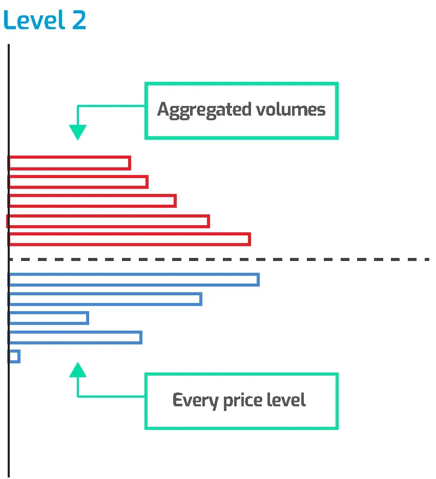

# Limit Order Book

## 1. Introduction

### 1.1 What is a limited order book (LOB)

- A limit order book is a record of outstanding limit orders. A limit order is a
  type of order to buy or sell a security at a specific price or
  better.[[What Is a Limit Order Book?]](https://www.investopedia.com/terms/l/limitorderbook.asp)

### 1.2 L1/L2/L3 market data

- **L1 market data:** Provides more comprehensive by displaying the full depth
  of the order book. This includes multiple bid and ask prices at different
  levels, not just the best available
  prices [[Market Data](https://www.interactivebrokers.com/en/pricing/market-data-pricing.php)]

  

- **L2 market data:** Provides more comprehensive by displaying the full depth
  of the order book. This includes multiple bid and ask prices at different
  levels, not just the best available
  prices. [[Market Data](https://www.interactivebrokers.com/en/pricing/market-data-pricing.php)]
  L2 data is also sometimes referred to as market-by-price (MBP), since
  the updates to book depth are usually keyed by price or price level. It may
  also be called market depth or depth of market (
  DoM). [[L2](https://databento.com/microstructure/level-2-market-data)]

  

- **L3 market data:** Level 3 (L3) refers to market data that provides every
  individual buy and sell order at every price level. This is often also the
  highest granularity of data
  available. L3 data is also called market by order or full order book
  data. [[L3](https://databento.com/microstructure/level-3-market-data)]

    

      
      
      
    

## 2. Factors to consider before implementing an LOB

- To give some idea of the data volumes,
  the [Nasdaq TotalView ITCH](https://data.nasdaq.com/databases/NTV) feed,
  which is every event in every instrument traded on the Nasdaq, can have data
  rates of 20+ gigabytes/day with spikes of 3 megabytes/second or more. The
  individual messages average about 20 bytes each so this means handling
  100,000-200,000 messages per second during high volume
  periods. [[How to Build a Fast Limit Order Book]](https://web.archive.org/web/20110219163448/http://howtohft.wordpress.com/2011/02/15/how-to-build-a-fast-limit-order-book/)

### 2.1 The business use case

- Consider the below factors:
    - What queries need to be optimized for your application?
    - Sparsity of the book.
    - Statistical distribution of book
      events. [[Red Black Trees for Limit Order Book](https://quant.stackexchange.com/a/63161/83130)]

- Markets/products to trade/liquidity impacts engineering decisions:
    - In illiquid options, there may be very few resting orders on the book, so
      it may be cheaper to just store everything in arrays and linearly walk
      through them.
    - In liquid futures, most events only affect a few hundred price levels, and
      price bands might give you a bound on levels that you actually care about,
      so it is possible to preallocate the levels in an array and represent
      index prices as an offset from some initial state in number of
      ticks. [[Red Black Trees for Limit Order Book](https://quant.stackexchange.com/a/63161/83130)]

- LOB's behavior can differ depending on whether you are implementing an LOB for
  equities (order-based, a.k.a. Market by Order,
  MBO or
  L3) [[Market by Order (MBO)]](https://www.cmegroup.com/education/market-by-order-mbo.html), [[L3]](https://databento.com/microstructure/level-3-market-data)
  or futures (level-based, a.k.a., Market by Price or
  MBP) [[What is an efficient data structure to model order book?]](https://quant.stackexchange.com/a/32482/83130)

### 2.2 Engineering considerations

- There are three main operations that an LOB has to implement: add, cancel, and
  execute. The goal is to implement these operations in O(1) time while making
  it possible for the trading model to efficiently ask questions like:
    - what are the best bid and offer?
    - how much volume is there between prices A and B?
    - what is order X's current position in the
      book? [[How to Build a Fast Limit Order Book]](https://web.archive.org/web/20110219163448/http://howtohft.wordpress.com/2011/02/15/how-to-build-a-fast-limit-order-book/)

- If you can, you should also optimize for the particular exchange. For
  instance, it turns out that, last I checked, Nasdaq generates order IDs
  incrementally starting from a small number, so you can store all the orders in
  a giant array instead of a hashtable. This is really cache- and TLB-friendly
  compared to a hashtable because most updates tend to happen to
  recently-dereferenced
  orders. [[What is an efficient data structure to model order book?]](https://quant.stackexchange.com/a/32482/83130)

- https://github.com/da-bao-jian/fast_limit_orderbook
- [RGM Advisors Order Book Programming Problem](https://github.com/perrye2/LimitOrderBook/tree/master)

## 3. Review of some common data structure

### 3.1 Binary search tree

- A Binary Search Tree (BST) is a type of Binary Tree data structure, where the
  following properties must be true for any node "X" in the
  tree [[1](https://www.w3schools.com/dsa/dsa_data_binarysearchtrees.php)]:

    - The X node's left child and all of its descendants (children, children's
      children, and so on) have lower values than X's value.
    - The right child, and all its descendants have higher values than X's
      value.
    - Left and right subtrees must also be Binary Search
      Trees.

      

#### Common operations

- Insert

  
- Search (omitted for being too simple)

- Delete
    - If the node to be deleted is a leaf (i.e., it has no children): omitted
    - If the node to be deleted has one child: omitted
    - If the node to be deleted has two children:

      

### 3.2 Heap

- A Min-Heap is a Data Structure with the following
  properties.[[2](https://www.geeksforgeeks.org/introduction-to-min-heap-data-structure/)]
    - It is a complete Complete Binary Tree.
    - The value of the root node must be the smallest among all its descendant
      nodes and the same thing must be done for its left and right sub-tree
      also.

#### Common operations

- Insert

  

- Delete

  